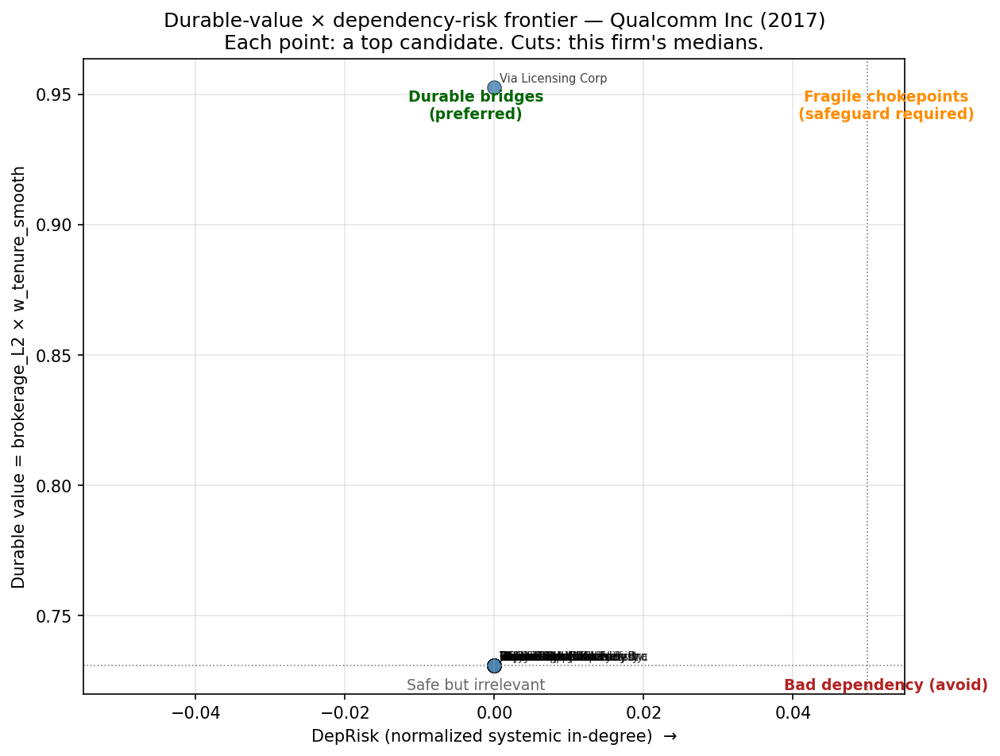

# Alignment (commercialization) report — Qualcomm Inc (747525)

- **Year**: 2017
- **Generated**: 2026-04-26 20:46:31
- **Pipeline**: strategic_pipeline v1

---

## Goal: Commercialization alliances (L2)

### The strategic question

Which downstream partners should you form a commercialization alliance with so that the partnership generates sales response, not just structural reach on paper?

### What the data say

- **Brokerage in L₂ pays.** L₂ brokerage is positively associated with future sales at $t{+}2$ ($p=0.045$) and $t{+}4$ ($p=0.031$) (paper Section 4, Table 3; two-way clustered SE).
- **The premium is gated by R&D capability.** The effect concentrates in top-quartile R&D firms in the focal's 2-digit SIC (paper Figure 3B / H2).
- **The premium is gated by tie persistence.** Hankel-DMD spectral analysis (paper Section 5) isolates a four-year sales cascade and shows newly-acquired L₂ brokerage produces *no* sales response. Value accrues to **sustained** ties (≥4 yr), not to acquisition.

### How candidates are ranked (durable-rent score)

$\text{score\_durable\_rent}(c) = \underbrace{\text{brokerage}_{L_2}(\text{focal}, c) \times w_{\text{tenure}}(c)}_{\text{durable value}} \;\times\; \underbrace{\exp\!\bigl(-\rho \cdot \text{DepRisk}(c)\bigr)}_{w_{\text{redundancy}}(c)}$

with a per-focal absorptive-capacity multiplier $g(\text{R\&D}_f) = 1 + \alpha \cdot \mathbf{1}\{f \in \text{top-quartile R\&D}\}$.

Component definitions:

- **brokerage_L2** ∈ [0, 1] — Burt-style structural opportunity: fraction of candidate's L2 neighborhood *not* shared with the focal.
- **w_tenure_smooth** ∈ (0, 1) — Dyer-Singh-style relational capability: $\sigma(z)$ where $z$ is the candidate's $\log(1 + \text{median tenure})$ z-scored against the SIC×L2 cohort baseline. Candidates above the cohort median score $> 0.5$; below score $< 0.5$. Industry-normalized so a short spell in a fast-cycling sector does not look like churn.
- **DepRisk** ∈ [0, 1] — candidate's normalized in-degree in the corrected systemic-criticality cross-section. High = many other firms already list this candidate as a top-5 critical partner.
- **w_redundancy** = $\exp(-1.5 \cdot \text{DepRisk})$ — penalty for adding a hub partner (creates portfolio fragility, paper §6 systemic report).
- **durable_value** = brokerage_L2 × w_tenure_smooth — y-axis of the frontier scatter below.
- **score_durable_rent** = durable_value × w_redundancy — the column the recommendation ranks on.

**R&D gate** (top-quartile R\&D intensity within your SIC): NOT PASSED

> WARNING: focal firm is NOT in top R&D quartile within SIC. The paper's L2 brokerage premium is uniquely concentrated in top-quartile R&D firms (Figure 3B, Table 3); for this firm, L2 brokerage recommendations should be treated as structural fit only, NOT as causal forecasts of sales response (g(R&D) = 1.00, no bonus). Consider Innovation (L1) alliances to build R&D capacity first.

> Candidates ranked by score_durable_rent = durable_value × w_redundancy, where:
  • durable_value = brokerage_L2 × w_tenure_smooth — Burt structural opportunity × Dyer-Singh relational capability.  w_tenure_smooth is the sigmoid of the candidate's SIC×L2 z-scored log(1+median tenure), so a candidate with above-median tie longevity in its industry scores > 0.5; below-median scores < 0.5.
  • w_redundancy = exp(-1.5 × DepRisk), where DepRisk is the candidate's normalized in-degree in the corrected systemic-criticality cross-section.  Adding a hub partner (many other firms already depend on it) is penalized.
Per-focal: g(R&D) is applied as an absorptive-capacity multiplier on durable_value (constant within a single firm's report; affects cross-firm comparisons only).

## Top candidate partners

| candidate_cusip   | firm_name                    |   sic2 |   brokerage_L2 |   persistence_factor |   sustained_share |   n_current_ties |   adjusted_brokerage_L2 |   median_tenure_yrs | tenure_layer_used   |   n_ties_for_tenure |   z_tenure_sic_L2 |   w_tenure_smooth |   dep_risk |   w_redundancy |   durable_value |   score_durable_rent |
|:------------------|:-----------------------------|-------:|---------------:|---------------------:|------------------:|-----------------:|------------------------:|--------------------:|:--------------------|--------------------:|------------------:|------------------:|-----------:|---------------:|----------------:|---------------------:|
| 1F1999            | Via Licensing Corp           |     67 |              1 |                0.5   |              0    |                2 |                   0.5   |                 1.5 | L2                  |                   2 |                 3 |          0.952574 |          0 |              1 |        0.952574 |             0.952574 |
| 92335C            | Vera Bradley Inc             |     31 |              1 |                0.5   |              0    |                7 |                   0.5   |                 1   | L2                  |                   4 |                 1 |          0.731059 |          0 |              1 |        0.731059 |             0.731059 |
| 7F4419            | Flipkart Pvt Ltd             |     59 |              1 |                0.5   |              0    |                7 |                   0.5   |                 1   | L2                  |                   2 |                 1 |          0.731059 |          0 |              1 |        0.731059 |             0.731059 |
| 91475M            | UCLA                         |     82 |              1 |                0.7   |              0.4  |                5 |                   0.7   |                 1   | L2                  |                   6 |                 1 |          0.731059 |          0 |              1 |        0.731059 |             0.731059 |
| 47810P            | Johns Hopkins University     |     82 |              1 |                0.625 |              0.25 |                4 |                   0.625 |                 1   | L2                  |                  12 |                 1 |          0.731059 |          0 |              1 |        0.731059 |             0.731059 |
| 126650            | CVS Health Corp              |     59 |              1 |                0.875 |              0.75 |                4 |                   0.875 |                 1   | L2                  |                   4 |                 1 |          0.731059 |          0 |              1 |        0.731059 |             0.731059 |
| 556269            | Steven Madden Ltd            |     31 |              1 |                0.5   |              0    |                3 |                   0.5   |                 1   | L2                  |                   7 |                 1 |          0.731059 |          0 |              1 |        0.731059 |             0.731059 |
| 91510C            | University of Texas System   |     82 |              1 |                0.5   |              0    |                3 |                   0.5   |                 1   | L2                  |                   3 |                 1 |          0.731059 |          0 |              1 |        0.731059 |             0.731059 |
| 229669            | Cubic Corp                   |     82 |              1 |                0.5   |              0    |                3 |                   0.5   |                 1   | L2                  |                   2 |                 1 |          0.731059 |          0 |              1 |        0.731059 |             0.731059 |
| 6F7534            | Generation Next Fran Brand   |     59 |              1 |                0.5   |              0    |                2 |                   0.5   |                 1   | L2                  |                   2 |                 1 |          0.731059 |          0 |              1 |        0.731059 |             0.731059 |
| 9A9749            | Vapor Town LLC               |     59 |              1 |                0.5   |              0    |                2 |                   0.5   |                 1   | L2                  |                   2 |                 1 |          0.731059 |          0 |              1 |        0.731059 |             0.731059 |
| 66459Q            | Northeastern University      |     82 |              1 |                1     |            nan    |                1 |                   1     |                 1   | L2                  |                   2 |                 1 |          0.731059 |          0 |              1 |        0.731059 |             0.731059 |
| 962149            | Weyco Group Inc              |     31 |              1 |                1     |            nan    |                1 |                   1     |                 1   | L2                  |                   2 |                 1 |          0.731059 |          0 |              1 |        0.731059 |             0.731059 |
| 854403            | Stanford University          |     82 |              1 |                1     |            nan    |                1 |                   1     |                 1   | L2                  |                  28 |                 1 |          0.731059 |          0 |              1 |        0.731059 |             0.731059 |
| 676220            | Office Depot Inc             |     59 |              1 |                1     |            nan    |                1 |                   1     |                 1   | L2                  |                  11 |                 1 |          0.731059 |          0 |              1 |        0.731059 |             0.731059 |
| 978097            | Wolverine World Wide Inc     |     31 |              1 |                1     |            nan    |                1 |                   1     |                 1   | L2                  |                   7 |                 1 |          0.731059 |          0 |              1 |        0.731059 |             0.731059 |
| 690370            | Overstock.com Inc            |     59 |              1 |                1     |            nan    |                1 |                   1     |                 1   | L2                  |                   4 |                 1 |          0.731059 |          0 |              1 |        0.731059 |             0.731059 |
| 49245E            | Kerry Group Ltd              |     42 |              1 |                1     |            nan    |                1 |                   1     |                 1   | L2                  |                   4 |                 1 |          0.731059 |          0 |              1 |        0.731059 |             0.731059 |
| 773104            | Rockefeller University       |     82 |              1 |                1     |            nan    |                1 |                   1     |                 1   | L2                  |                   6 |                 1 |          0.731059 |          0 |              1 |        0.731059 |             0.731059 |
| 13036M            | California Institute of Tech |     82 |              1 |                1     |            nan    |                1 |                   1     |                 1   | L2                  |                   4 |                 1 |          0.731059 |          0 |              1 |        0.731059 |             0.731059 |

## Durable-value × dependency-risk frontier

**Quadrant reading** (cuts at this firm's medians):

- **Top-left — Durable bridges** (low risk, high durable value). The preferred partner type: structurally non-redundant, demonstrably persistent, not yet a systemic hub.
- **Top-right — Fragile chokepoints** (high risk, high durable value). Valuable but consider redundancy safeguards (multi-source contracting, equity stake, or M&A) before depending on a partner that many other firms already depend on.
- **Bottom-left — Safe but irrelevant**. No commercialization upside, no exposure created.
- **Bottom-right — Bad dependency**. Avoid unless there is a separate strategic reason; the sales premium is small and the systemic exposure is large.

---

### Why the durable-rent score is more accurate than raw brokerage

The previous version of this recommender ranked candidates on raw L₂ brokerage alone.  Two empirical and theoretical considerations make that ranking systematically biased:

1. **Brokerage saturates for sparse focal portfolios.**  When the focal firm has few L₂ ties (true for most firms), almost every candidate achieves the maximum brokerage score of 1.0 (no overlap with the focal's L₂ neighborhood). The original ranking then surfaced whichever candidates the dataframe sort happened to put first — typically single-tie newcomers with no verifiable track record.
2. **Single-tie newcomers are the wrong type.**  A candidate with one brand-new tie sits in the *acquisition* regime that the Hankel-DMD analysis shows produces no sales response.  A candidate with five sustained ties sits in the *persistence* regime where the L₂ premium realizes.  Ranking by raw brokerage alone systematically routes you toward partners least likely to generate value.

The persistence re-ranker corrects both biases by down-weighting candidates whose own portfolios show high churn and by elevating candidates whose demonstrated tie maintenance signals the organizational capability to invest in joint value creation.

### Management-science framing

- **Brokerage vs. relational view, reconciled.**  Burt's structural-holes view says value comes from spanning disconnected clusters.  Dyer & Singh's relational view says value comes from partner-specific investments, governance, and knowledge-sharing routines built up over time.  The L₂ brokerage premium *only* materializes when both conditions hold: structural opportunity (brokerage) **and** relational capability (sustained ties).  The recommender now operationalizes both, in that order.
- **Alliance capability as a dynamic capability.**  Firms that maintain alliances accumulate alliance-management routines, dedicated alliance functions, and partner-specific absorptive capacity (Anand & Khanna 2000; Kale, Dyer & Singh 2002).  A candidate's sustained-share is a behavioral signal of this capability — a Spence-style screening device that is hard to fake.
- **Avoid the novelty trap.**  The temptation in alliance scouting is to chase fresh, unencumbered candidates who are 'available'.  The data say the L₂ commercialization premium goes to the *opposite* type: candidates whose calendars are already full of multi-year alliances are the ones who will make multi-year commitments to you.
- **Redundancy as a feature, not a bug.**  In the structural-holes literature, partner-of-partners redundancy is treated as wasted bandwidth.  Under the corrected scorer it is partly *evidence of type*: a candidate whose neighborhood is densely co-active is more likely to have built the ecosystem-level routines that downstream commercialization requires.

### How to read the table

- `brokerage_L2` ∈ [0, 1]: classic Burt brokerage (higher = more non-redundant market access via this candidate).
- `persistence_factor` ∈ [0.5, 1.0]: 1.0 = all current ties are sustained; 0.5 = none are.  Defaults to 1.0 for candidates with <2 current ties.
- `sustained_share`: fraction of the candidate's current ties whose first year is ≥ 4 years before this report's year.
- `n_current_ties`: candidate's tie count in the 5-year window across all layers.
- `adjusted_brokerage_L2`: the column the recommendation ranks on.

### Limitations

- Recommendations are **associational**.  Brokerage and persistence are structural and behavioral features, not causal forecasts of joint future value for a specific dyad.
- The persistence factor uses ties across all four layers as a general 'maintain vs churn' proxy, not L₂-only — L₂ portfolios are too sparse for a layer-specific signal.
- The brokerage premium is empirically conditioned on top-quartile R&D status (paper H2).  Firms outside that quartile should treat the ranking as structural fit only.
