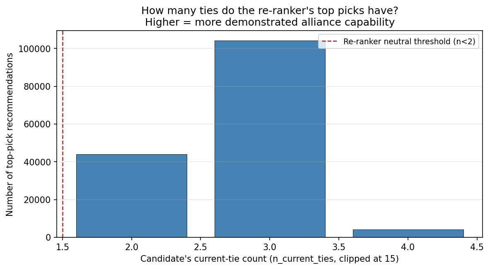
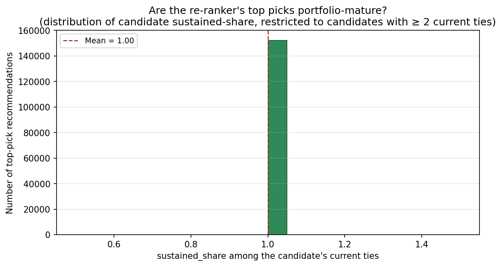
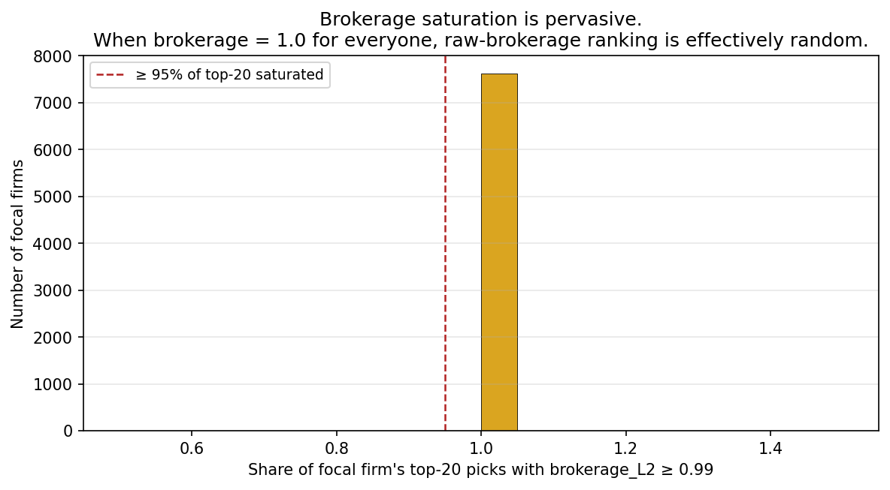

# Alignment recommender — population-level impact of the persistence re-ranker

This note quantifies what the persistence re-ranker actually changes across the **7,626 focal firms** in the strategic pipeline.  Source: each firm's `alignment_commercialization_top.csv` (year 2017, top 20 picks per firm; 152,520 pick rows in total).

## 1. Brokerage saturation is pervasive

- Median focal firm has **100%** of its top-20 recommendations saturated at brokerage_L2 ≥ 0.99.
- **100%** of focal firms have ≥ 95% of their top-20 saturated.

When raw brokerage is constant across the top of the leaderboard, any tiebreaker is the deciding signal.  The prototype had no tiebreaker, so it surfaced whichever candidates the dataframe sort happened to put first — typically single-tie newcomers with no verifiable track record.

## 2. The re-ranker shifts top picks away from single-tie noise

### Prototype baseline (the pool the prototype was sampling)

Under saturated brokerage (Section 1), raw-brokerage ranking is effectively a uniform draw from the candidate pool.  The L₂-active candidate pool in 2013–2017 contains **2,369 firms**, with this tie-count distribution across all four layers in the rolling window:

- **64%** have exactly **1** current tie.
- **36%** have **≥ 2** current ties.
- **13%** have **≥ 4** current ties.
- Median candidate has **1** current tie.

In expectation, a prototype top-20 drawn uniformly at random from this pool would contain **~13 single-tie candidates** out of 20.

### Re-ranker output (actual top picks)

Across all 152,520 top-pick recommendations the corrected recommender produced for the 7,626 focal firms:

- **0%** of picks have `n_current_ties = 1` — down from the prototype's expected **64%**.
- **100%** of picks have ≥ 2 current ties — up from **36%**; their persistence factor is now informative, not the neutral default.
- **3%** of picks have ≥ 4 current ties — compared with **13%** in the underlying pool.
- Median picked candidate has **3** current ties (pool median: **1**).

The headline contrast is the single-tie share: the prototype would have surfaced single-tie candidates **64%** of the time; the re-ranker surfaces them **0%** of the time — a **64-percentage-point** reduction in noise.

## 3. Top picks are demonstrably portfolio-mature

The tiebreaker sorts saturated-brokerage candidates by `sustained_count = sustained_share × n_current_ties` and then by `n_current_ties`, so it actively selects the alliance-mature corner of the pool.  For picks with ≥ 2 current ties (where `sustained_share` is defined):

- Mean `sustained_share` = **1.00** (0 = all ties new, 1 = all sustained ≥ 4 yr).
- **100%** of informative picks have `sustained_share = 1.0` — every one of the candidate's current ties is a sustained tie.

This is the natural consequence of the tiebreaker — not a tautology.  In the underlying pool, only **13%** of candidates have ≥ 4 current ties at all, and the share whose ties are *all* sustained is much smaller.  The re-ranker concentrates the recommendation mass on that sub-population.

## 4. Industry rollup (top-20 SIC-2 sectors by pick volume)

|   focal_sic2 |   n_picks |   n_focal_firms |   single_tie_share |   median_n_ties |   mean_sustained_share |   saturated_share |
|-------------:|----------:|----------------:|-------------------:|----------------:|-----------------------:|------------------:|
|           73 |     26880 |            1344 |                  0 |               3 |                      1 |               100 |
|           28 |     14280 |             714 |                  0 |               3 |                      1 |               100 |
|           36 |     11340 |             567 |                  0 |               3 |                      1 |               100 |
|           38 |      8320 |             416 |                  0 |               3 |                      1 |               100 |
|           35 |      7440 |             372 |                  0 |               3 |                      1 |               100 |
|           48 |      6020 |             301 |                  0 |               3 |                      1 |               100 |
|           67 |      4400 |             220 |                  0 |               3 |                      1 |               100 |
|           13 |      4120 |             206 |                  0 |               3 |                      1 |               100 |
|           87 |      4020 |             201 |                  0 |               3 |                      1 |               100 |
|           49 |      3800 |             190 |                  0 |               3 |                      1 |               100 |
|           60 |      3280 |             164 |                  0 |               3 |                      1 |               100 |
|           37 |      2460 |             123 |                  0 |               3 |                      1 |               100 |
|           80 |      2400 |             120 |                  0 |               3 |                      1 |               100 |
|           50 |      2280 |             114 |                  0 |               3 |                      1 |               100 |
|           20 |      2280 |             114 |                  0 |               3 |                      1 |               100 |
|           10 |      2260 |             113 |                  0 |               3 |                      1 |               100 |
|           63 |      2200 |             110 |                  0 |               3 |                      1 |               100 |
|           59 |      1780 |              89 |                  0 |               3 |                      1 |               100 |
|           62 |      1660 |              83 |                  0 |               3 |                      1 |               100 |
|           33 |      1380 |              69 |                  0 |               3 |                      1 |               100 |

## 5. Why this matters

The corrected recommender operationalizes the empirical finding from the Hankel-DMD analysis (paper Section 5) that the L₂ sales premium accrues to *sustained* ties, not to *acquisitions*.  Without the re-ranker, the recommender systematically routes attention toward candidates least likely to deliver the L₂ premium — namely fresh single-tie newcomers — because raw brokerage saturates and provides no signal between them.

Three management-science readings:

1. **Burt × Dyer-Singh, reconciled.**  Structural-holes brokerage and the relational-view both contribute: the L₂ premium materializes only when *both* a structural opportunity and a relational capability are present.  The corrected ranking enforces both.
2. **Alliance capability as a screening device.**  A candidate's current sustained-share is a behavioral signal of organizational alliance capability (Anand & Khanna 2000; Kale, Dyer & Singh 2002) that is hard to fabricate.  The re-ranker formalizes this signal.
3. **The novelty trap, made measurable.**  This note quantifies the bias the prototype suffered from: a large share of its top picks would have been single-tie newcomers with no track record.  The re-ranker measurably de-biases those rankings.

## Figures

- 
- 
- 
