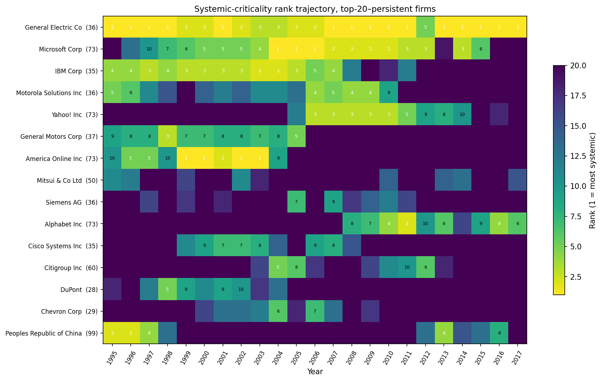
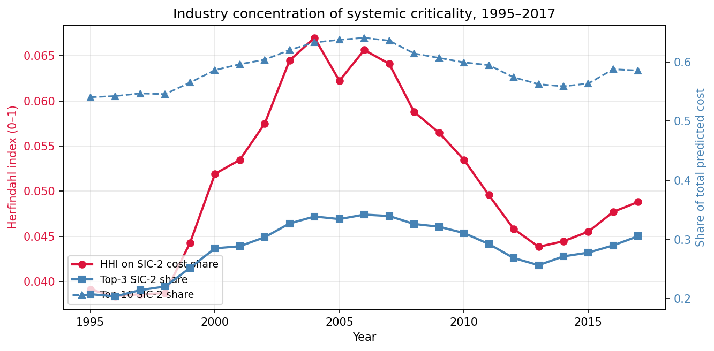
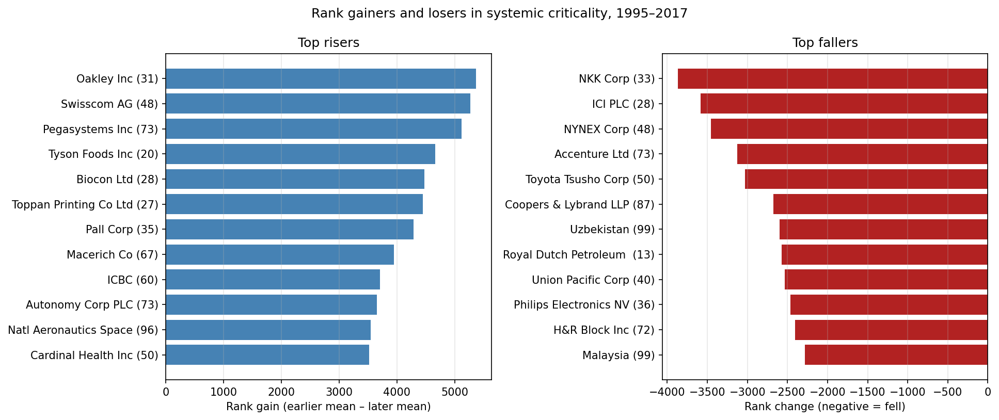
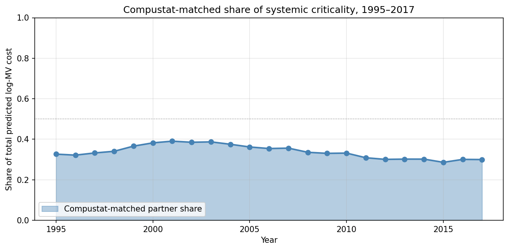
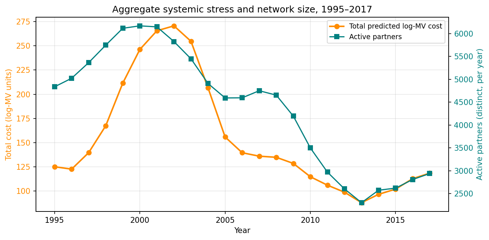

# Systemic-Criticality Meta-Network — Master Summary

- **Report directories generated**: 7,626
- **Non-empty legacy 2017 vulnerability CSVs**: 1,754
- **Active 2017 focal firms contributing edges**: 1,754
- **Distinct critical partners**: 2,939
- **Total edges (top-5 per focal)**: 3,690
- **Duplicate normalized partner rows**: 0
- **Compustat-matched among top-20**: 11/20

## Top 20 systemic-critical firms

|   rank | partner_cusip   | name                          |   sic2 | is_compustat   |   in_degree |   total_predicted_log_mv_cost |   mean_predicted_log_mv_cost |
|-------:|:----------------|:------------------------------|-------:|:---------------|------------:|------------------------------:|-----------------------------:|
|      1 | 369604          | General Electric Co           |     36 | True           |          25 |                      1.25582  |                    0.0502326 |
|      2 | 30231G          | Exxon Mobil Corp              |     29 | True           |           8 |                      0.599248 |                    0.074906  |
|      3 | 82929F          | Singapore                     |     99 | False          |           7 |                      0.437473 |                    0.0624962 |
|      4 | 00206R          | AT&T Inc                      |     48 | True           |           7 |                      0.431672 |                    0.0616675 |
|      5 | 780259          | Royal Dutch Shell PLC         |     29 | True           |           7 |                      0.417924 |                    0.0597034 |
|      6 | 9C7309          | Alphabet Inc                  |     73 | False          |          10 |                      0.408885 |                    0.0408885 |
|      7 | 260543          | The Dow Chemical Co           |     28 | False          |           6 |                      0.387543 |                    0.0645905 |
|      8 | 023135          | Amazon.Com Inc                |     59 | True           |           9 |                      0.376214 |                    0.0418016 |
|      9 | 494550          | Kinder Morgan Energy Partners |     49 | True           |           5 |                      0.338643 |                    0.0677285 |
|     10 | 09253U          | Blackstone Group LP           |     67 | False          |           8 |                      0.32559  |                    0.0406988 |
|     11 | 097023          | Boeing Co                     |     37 | True           |           5 |                      0.311257 |                    0.0622515 |
|     12 | 084670          | Berkshire Hathaway Inc        |     63 | True           |           5 |                      0.293885 |                    0.0587771 |
|     13 | 90937E          | United Arab Emirates          |     99 | False          |           4 |                      0.288497 |                    0.0721243 |
|     14 | 747525          | Qualcomm Inc                  |     36 | True           |           7 |                      0.276819 |                    0.0395455 |
|     15 | 606827          | Mitsui & Co Ltd               |     50 | True           |           3 |                      0.273473 |                    0.0911576 |
|     16 | 59284B          | Mexichem SAB de CV            |     28 | False          |           3 |                      0.261792 |                    0.0872641 |
|     17 | 343412          | Fluor Corp                    |     87 | True           |           5 |                      0.260047 |                    0.0520093 |
|     18 | 80412Q          | Saudi Arabia                  |     99 | False          |           3 |                      0.246808 |                    0.0822692 |
|     19 | 14309L          | The Carlyle Group LP          |     67 | False          |           7 |                      0.244258 |                    0.034894  |
|     20 | 89151E          | Total SA                      |     13 | False          |           5 |                      0.243523 |                    0.0487045 |

## Industry concentration (top 10 SIC-2 by in-degree)

|   sic2 |   total_in_degree |   total_cost |   n_firms |
|-------:|------------------:|-------------:|----------:|
|     73 |               546 |     12.1422  |       457 |
|     28 |               436 |     10.8475  |       335 |
|     67 |               355 |     13.252   |       285 |
|     87 |               205 |      5.24319 |       176 |
|     36 |               181 |      5.49535 |       122 |
|     48 |               136 |      4.15547 |        89 |
|     80 |               133 |      4.09634 |       116 |
|     49 |               129 |      5.26071 |        95 |
|     38 |               123 |      3.67941 |       107 |
|     35 |               116 |      3.66774 |        81 |

## Figures

- 
- 
- 
- 

## Interpretation & caveats

- Each active focal firm contributes up to 5 directed edges (its top partners by partner-specific predicted loss); firms with fewer active partners contribute fewer than 5.
- **Predicted loss** combines layer-specific exit weights, dyad tenure, tie strength, redundancy, partner centrality, and first-order counterfactual betweenness exposure.
- Stacked-cohort estimates are the conservative causal reference where available; legacy TWFE estimates are retained in `estimator_robustness.csv` because they are not identical.
- Top systemic-critical firms are defined by *aggregate* cost; firms with low in-degree but large per-dyad cost can still rank high (e.g., a single very large partnership).

## Annual dynamics, 1995–2017

The annual panel (`systemic_criticality_annual.csv`, 100,685 rows across 23 years) exposes time-series structure that the 2017 cross-section obscures.  Artifacts: `rank_trajectories.csv`, `top20_persistence.csv`, `risers_fallers.csv`, `industry_concentration_annual.csv`, `compustat_share_annual.csv`, `aggregate_stress_annual.csv`.

**Aggregate stress.** Total predicted log-MV cost peaks in 2002 (270.6) and troughs in 2013 (88.1), tracking the dot-com buildout and the post-2008 alliance-formation slowdown.  Active-partner count peaks in 2000 at 6,169 and declines to 2,939 in 2017, a 52 % contraction of the distinct-partner universe.

**Top-20 persistence.** Year-over-year retention of the top-20 systemic-critical set averages 71.4 %: the leaderboard is neither static nor volatile.  Peak stability is 2001 (85 % retained); the weakest retention is 2006 (50 %).  Four firms sit in the top-20 for ≥ 15 of 23 years: General Electric (23/23), Microsoft (20), IBM (17), Motorola Solutions (15).

**Risers.** Constrained to firms that reached the top-100 in at least one year, the largest rank gainers are Oakley (+5 368), Swisscom (+5 271), Pegasystems (+5 124), Tyson Foods (+4 667), and Biocon (+4 473); Alphabet, Amazon, and Cardinal Health enter the persistent top-20 from lower starting positions.

**Fallers.** Pre-merger legacy entities dominate the fall list — Exxon Corp, Daimler-Benz, Royal Dutch Petroleum, Shell Transport & Trading, NYNEX, ICI PLC, Coopers & Lybrand — reflecting ticker changes after M&A rather than genuine loss of systemic role.  This is a data-integration artifact; when read against the merged-entity successors, these firms have not actually exited the network.

**Industry concentration.** Herfindahl-Hirschman on SIC-2 shares of total predicted cost rises from 0.038 (1996) to a dot-com-era peak of 0.067 (2004) before relaxing to 0.049 (2017).  SIC 36 (electronics) leads through 1997; SIC 73 (services / software) becomes the leading sector from 1998 through 2014.

**Compustat-matched share.** Compustat firms account for 32.7 % of total predicted cost in 1995 and 30.0 % in 2017, with a dot-com-era maximum of 39.1 % (2001) and a post-2008 minimum of 28.6 % (2015).  The remainder is sovereign entities (PRC, Singapore, UAE, Saudi Arabia), private-equity vehicles (Blackstone, Carlyle), and non-US public firms lacking a Compustat North-America match — a reminder that the meta-network is decidedly not US-only.

## Annual-dynamics figures

- 
- 
- 
- 
- 
